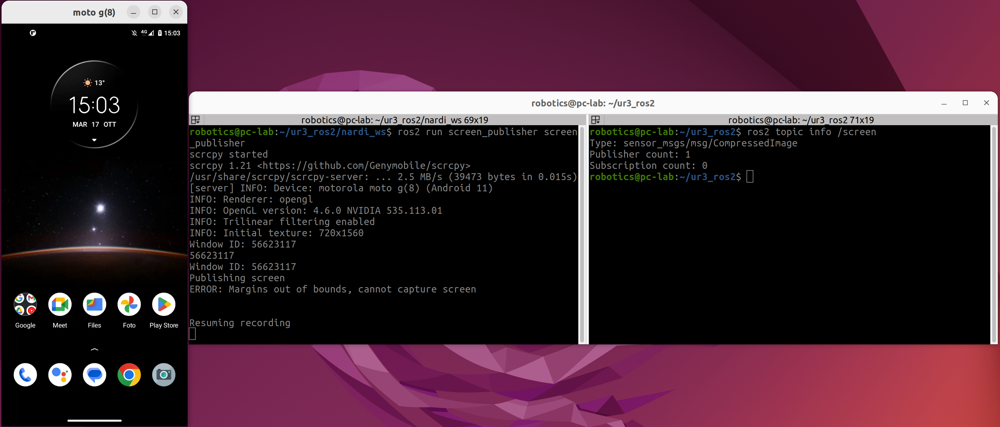

# Android_Screen_Publisher_ROS2
This is a simple ROS2 package that broacast the screen of your android device display to your desktop using [scrcpy](https://github.com/Genymobile/scrcpy/tree/master), and publish the result on a topic using the CompressedImage msg type.
  
## Pre requirements
Having scrcpy and xdotool installed:
```
sudo apt-get update
sudo apt-get install scrcpy xdotool
```
Having the required pip packages:
```
pip install opencv-python numpy Pillow python-xlib
```


## Installation
```
cd <your_ws>/src
git clone https://github.com/Hydran00/Android_Screen_Publisher_ROS2.git
mv Android_Screen_Publisher_ROS2 screen_publisher
cd ..
colcon build
```

## Running the node
1. Enable USB Debug and plug your smartphone via USB.
2. Set the window's name:   
For running the node (that records the window of the broadcasted display on your desktop) you need to know what is the name of the window. Since it is different for every android you can check it launching ``scrcpy`` and look at the top center name of the window.  
Then modify the var window_name under ``screen_publisher/screen_publisher.py`` in the main function with the same name.  
This is done to retrieve the correct window for recording it.
3. Set the topic name:  
Modify the var topic_name under ``screen_publisher/screen_publisher.py`` accordingly.
4. Run the node:  
```
ros2 run screen_publisher screen_publisher
```
5. Enjoy!


